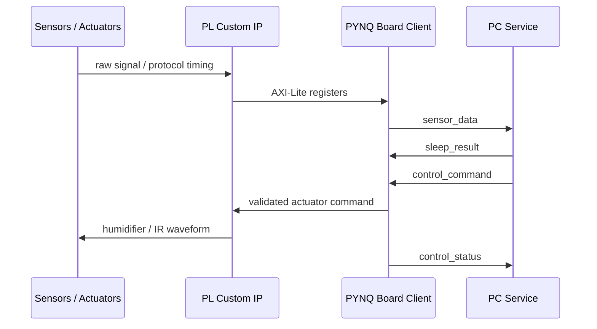
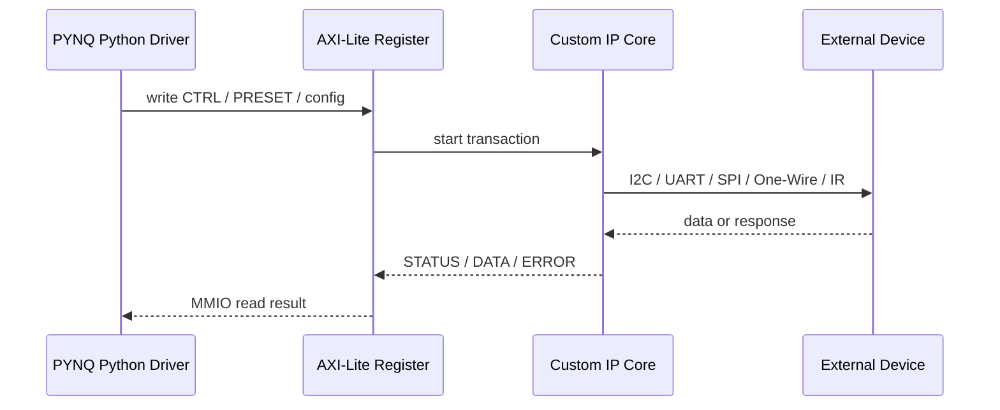
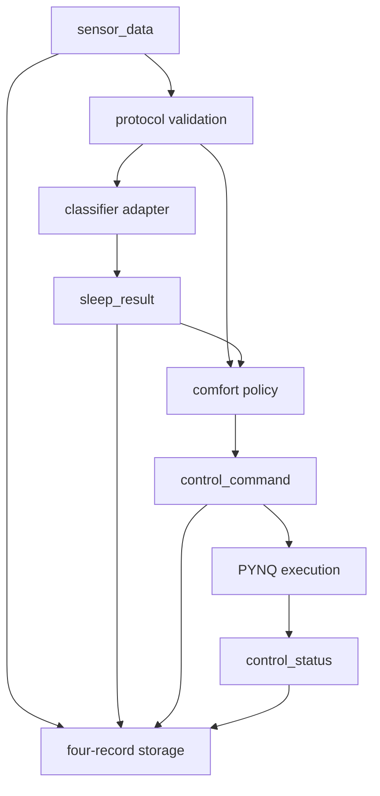

<!--
已确认答辩条件：PPT 汇报 20 min，页数无硬性限制；另有 10 min 对照实物展示环节。
推荐规模：26-30 页主 PPT，平均 35-45 s/页，保留 1-2 min 缓冲。
叙事原则：系统应用闭环是项目主线；RTL/IP 详细设计是硬件课设考核基线，
需要由小组成员分别讲完整，不应被压缩成附属内容。
建议实现格式：Pandoc Markdown / Marp Markdown 均可。
图表建议先用 Mermaid 或 draw.io 出图，最终导出 PPTX 前转成 PNG。
注意：系统输出是辅助估计，不是临床诊断结果。
-->

# 1. 作品题目

**基于 PYNQ-Z1 的智能睡眠监测与辅助系统**

- 关键词：PYNQ-Z1、Zynq PS/PL 协同、多传感器采集、睡眠状态估计、环境辅助控制。
- 一句话介绍：系统采集心率血氧、姿态运动、温湿度等数据，在板端显示关键状态，并通过 PC 端完成记录、分类和控制策略闭环。
- 建议素材：项目实物照片作为首页背景，标题不放在卡片里。

# 2. 汇报结构与时间分配

建议 20 min 主汇报采用“系统主线 + 成员 IP 深讲”的组合：

| 部分 | 页数 | 时间 | 目标 |
|---|---:|---:|---|
| 选题与总体闭环 | 4-5 | 3 min | 说明为什么做、系统如何闭环 |
| RTL/IP 分成员深讲 | 10-12 | 8 min | 每位成员讲清负责 IP 的协议、寄存器、状态机和验证 |
| PYNQ/PC 系统应用 | 5-6 | 5 min | 展示软件编排、分类策略、通信记录和系统完整性 |
| 验证与最终结果 | 5-6 | 3 min | 用证据证明硬件平台和端到端链路跑通 |
| 总结与展望 | 2 | 1 min | 收束贡献、边界和后续工作 |

成员讲述口径：每位成员负责的 RTL/IP 至少回答四件事：模块在系统中解决什么问题、外设协议或关键时序怎么实现、AXI-Lite 寄存器怎样给软件使用、用什么仿真/板端证据证明可用。

# 3. 选题背景

- 家庭睡眠监测需要低成本、非侵入式、可长期运行的多源数据采集方案。
- 单一传感器容易误判；本项目组合生理、运动、环境三类信号。
- PYNQ-Z1 适合课程设计：PL 负责外设协议时序，PS 负责软件编排，PC 负责分析和记录。

# 4. 项目目标与系统边界

- 目标 1：完成心率血氧、姿态运动、温湿度的板端采集。
- 目标 2：完成 TFT 本地显示和加湿器/红外空调辅助控制。
- 目标 3：完成 PYNQ 到 PC 的数据上传、分类结果、控制命令、执行状态闭环。
- 边界：睡眠状态是辅助估计，不作为临床诊断；空调真实状态无反馈时只能通过人工观察确认。

# 5. 系统总体架构

建议图表：三层架构图。

```mermaid
flowchart LR
  subgraph PL["PL 自定义 IP 层"]
    JY[JY901 I2C AXI]
    DHT[DHT11 AXI]
    SPO2[UART SpO2 AXI]
    TFT[TFT SPI AXI]
    HUM[Humidifier AXI]
    IR[Gree IR AC AXI]
  end
  subgraph PS["PYNQ/PS 板端软件"]
    ORCH[BoardOrchestrator]
    DISP[TFT 状态显示]
    GUARD[执行校验与限频保护]
  end
  subgraph PC["PC 服务与分析"]
    SOCK[Socket Service]
    CLS[Sleep Classifier Adapter]
    POLICY[Comfort Policy]
    STORE[JSONL/Excel Records]
    DASH[Dashboard]
  end
  PL --> PS --> PC
  PC --> PS --> PL
```

# 6. 数据流与控制流闭环

建议图表：把数据流和控制流用不同颜色画出来。

# 7. 硬件平台与模块组成

建议图表：模块清单表 + 实物连线照片。

| 类型 | 模块 | 接口 / IP | 当前状态 |
|---|---|---|---|
| 生理信号 | 心率血氧 | UART SpO2 AXI | 集成板端烟测通过 |
| 姿态运动 | JY901 / MPU9250 | I2C AXI | 集成板端烟测通过 |
| 环境数据 | DHT11 | One-Wire AXI | 集成板端烟测通过 |
| 本地显示 | 1.3 寸 TFT | SPI AXI | 集成板端烟测通过 |
| 辅助控制 | 加湿器/LED | AXI 控制 IP | 集成板端烟测通过 |
| 辅助控制 | 格力空调红外 | Gree IR AXI | 实验室空调响应已确认 |

# 8. Vivado 集成设计

- 当前集成硬件平台：`system_v0_2`。
- 输出物：匹配的 `.bit`、`.hwh`、`.tcl`。
- 总线结构：Zynq PS 通过 AXI/AXI-Lite 访问多个自定义 IP。
- 约束：外部 I/O 均按 PYNQ-Z1 3.3 V 逻辑处理，板级引脚由 XDC 管理。

# 9. PL 自定义 IP 设计共性方法

- 把时序敏感协议放入 PL：I2C、One-Wire、UART、SPI、IR 调制。
- 用 AXI-Lite 暴露统一的软件接口：`CTRL`、`STATUS`、数据寄存器、错误码。
- 业务逻辑不写死在 RTL：PC/PYNQ 决定策略，PL 保证协议时序和状态可观测。
- 这一组页面是硬件课设的考核基线，建议由各成员按负责模块分别讲，不只在系统图里带过。

建议每个成员的 RTL/IP 页面模板：

| 项目 | 必讲内容 |
|---|---|
| 系统角色 | 输入/输出是什么，为什么需要放在 PL |
| 协议与时序 | 状态机、计数器、采样/发送节拍、异常处理 |
| AXI 接口 | 关键寄存器、状态位、错误码、软件调用方式 |
| 验证证据 | testbench PASS、Vivado 集成、板端烟测或实物响应 |

# 10. JY901 / MPU9250 I2C IP 设计

建议图表：I2C burst read 时序。

- 建议作为负责成员的重点页之一。
- 默认 7-bit 地址 `0x50`，从寄存器 `0x34` 开始 burst read。
- 支持单次采样、自动周期采样、配置写入。
- 输出加速度、陀螺仪、磁力计、角度、温度等原始/缩放数据。
- 验证重点：ACK、超时、错误码、`sample_cnt` 增长和数据有效位。

# 11. DHT11 与 UART SpO2 采集设计

- 可按成员分工拆成两页：DHT11 单总线时序一页，SpO2 UART 帧解析一页。
- DHT11：PL 实现单总线时序和数据帧解析，PYNQ 读取温湿度寄存器。
- SpO2：UART 9600 baud 数据帧解析，支持 5-byte 轮询模式。
- 设计重点：把慢速、易受时序影响的外设协议从 Python 轮询中剥离出来。
- 汇报时强调：SpO2 实物接线需要 RX/TX 交叉，已在板端烟测中确认。

# 12. TFT 显示与加湿器控制设计

- 可按成员分工拆成两页：TFT SPI 显示 IP 一页，加湿器控制 IP 一页。
- TFT：SPI AXI IP 发送显示字节，PYNQ 侧负责 UI 内容和区域刷新。
- UI 内容：心率、血氧、翻身次数、温度、湿度、传感器状态、执行器状态。
- 加湿器：本项目使用板端 LED/控制 IP 表示执行状态，PC 策略下发目标状态。
- 设计重点：显示和执行器都走 AXI 可观测路径，便于调试和答辩演示。

# 13. 格力空调红外控制设计

- 建议作为独立重点页，因为它同时体现 RTL 时序、IP 集成和实物响应。
- TX-only Gree IR AC AXI IP，集成在 `system_v0_2`。
- 支持七个首版预设：`power_on`、`power_off`、`temp_24` 到 `temp_28`。
- PYNQ 侧加入命令合法性检查、最小发送间隔、重复命令 cooldown。
- 证据边界：`sent=true` 只说明红外波形发送完成；真实空调响应需要人工观察。

# 14. AXI-Lite 寄存器与软件驱动边界

建议图表：寄存器访问路径。

- 讲述重点：软件只依赖稳定寄存器语义，不依赖 RTL 内部状态机细节。

# 15. PYNQ 板端软件设计

- `integrated_demo.py`：集成硬件烟测入口，加载 bitstream 并读取多传感器。
- `board_orchestrator.py`：封装采样、TFT 更新、加湿器目标状态、IR 命令保护。
- `board_client.py`：socket 客户端，发送 `sensor_data`，接收结果和控制命令，返回执行状态。
- 设计原则：硬件驱动、业务编排、网络传输分层，便于隔离问题。

# 16. PC 端服务设计

建议图表：PC 端处理流水线。

- 关键拆分：协议、分类器适配、舒适度策略、状态存储、socket 服务分离。
- 设计理由：便于替换模型、复现实验、保留原始数据。

# 17. 通信协议设计

- 协议格式：TCP + newline-delimited JSON。
- 每个采样周期固定四类消息：
  `sensor_data -> sleep_result -> control_command -> control_status`。
- 设计要点：分类结果不混入控制命令；无动作也返回合法 `control_command`。
- 存储要点：原始传感器数据、模型输出、策略命令、执行结果四类记录分开保存。

# 18. 睡眠状态估计设计

- 分类器：PC 端通过 `sleep_classifier.py` / `sleep_model.bin` 完成 DREAMT GRU 推理。
- 适配层：`classifier_adapter.py` 屏蔽模型内部实现，统一输出 `sleep_result`。
- 状态编码：`0` 清醒/未睡，`1` 浅睡，`2` 深睡。
- 保护策略：`state_valid=0` 时不自动改变执行器状态。

# 19. 舒适度控制策略

- 输入：睡眠状态、温度、湿度、最近一次空调命令、加湿器状态。
- 湿度策略：低湿度优先打开加湿器，高湿度关闭加湿器。
- 温度策略：空调命令限制在已验证的 `24..28 C` 预设范围。
- 睡眠阶段差异：深睡时减少扰动，接受更宽温度范围和更长 cooldown。

# 20. 验证方法与证据链

建议图表：验证层级表。

| 层级 | 已有证据 |
|---|---|
| RTL 仿真 | 多个 Icarus Verilog testbench 输出 PASS；IR TX 回归覆盖 preset/start/done/error |
| Vivado 集成 | `system_v0_2` 导出 `.bit/.hwh/.tcl`，路由 DRC 0 violations，时序满足 |
| 板端烟测 | JY901、DHT11、UART SpO2、TFT、加湿器、IR AC 均有集成运行证据 |
| PC/PYNQ 协议 | `pynq_integration_smoke` 已记录四类 JSONL，每类 33 条 |

# 21. 板端实测结果

建议素材：PYNQ 运行截图、TFT 屏幕照片、实物接线照片。

- JY901 返回 `data_valid=1`，`jy901_status=OK`。
- DHT11 返回温湿度，例如约 `27 C`、`15-16% RH`。
- UART SpO2 返回心率和血氧，例如 `101-109 bpm`、`99%`。
- 加湿器状态参与板端循环；TFT 能更新显示核心指标。

# 22. 红外空调实测结果

- 集成 overlay 下 PYNQ MMIO 能访问 IR IP，基地址 `0x40005000`。
- 已发送并确认 IP 完成：`power_on`、`power_off`、`temp_26`。
- 实验室格力空调对上述命令有人工观察响应。
- 重要条件：红外发射头需要靠近并对准接收窗口，约 20 cm 内响应更可靠。

# 23. PC/PYNQ 闭环运行结果

建议表格：从 `pc_server/records/pynq_integration_smoke/` 选 1 个 sample_id 展示四类记录。

| 记录 | 示例说明 |
|---|---|
| `sensor_data` | 板端上传心率、血氧、JY901、温湿度、加湿器状态 |
| `sleep_result` | PC 返回模型结果；当前示例为 warmup，`state_valid=0` |
| `control_command` | 策略因模型 warmup 输出 no-action |
| `control_status` | PYNQ 接收命令并返回 skipped/status_code=2 |

讲述边界：这证明协议和记录链路跑通；不能把 warmup 样本讲成有效睡眠分期结果。

# 24. 最终实现功能结果

- 完成多传感器采集：心率、血氧、加速度/姿态、温度、湿度。
- 完成板端显示：TFT 实时显示核心指标和状态。
- 完成辅助执行：加湿器状态控制；格力空调红外 `power_on/power_off/temp_26` 实验响应确认。
- 完成 PC 闭环：板端 `sensor_data` 上传，PC 返回 `sleep_result` 和 `control_command`，板端返回 `control_status`。
- 完成记录保存：四类记录独立保存，保留原始数据与推理/控制结果边界。

# 25. 创新点与工程价值

- PS/PL 协同：PL 负责协议时序，PS/PC 负责策略和系统编排。
- 多源融合：生理、运动、环境数据统一成一套结构化协议。
- 可验证性：仿真、Vivado、板端、PC 记录分层留证据。
- 可扩展性：分类器、控制策略、仪表盘和存储后端都可替换。
- 工程完整性：不是单个 IP Demo，而是覆盖采集、显示、传输、分析、控制的系统原型。
- 答辩策略：先用成员 RTL/IP 证明硬件设计能力，再用系统闭环证明项目应用完整性。

# 26. 不足与后续工作

- 修正 PYNQ 板端系统时间，避免日志时间戳不一致。
- 延长真实数据采集，让分类器越过 warmup 并展示有效 `state_valid=1` 结果。
- 完成 dashboard HTTP/SSE 重构和更完整的交互展示。
- 加强翻身检测的标定和专门动作验证。
- 若要确认空调真实状态，需要 IR RX 或外部反馈；当前只确认发送和人工观察响应。

# 27. 答辩收束页

**结论：本项目完成了基于 PYNQ-Z1 的多传感器睡眠监测、板端显示、PC 端分类/策略接口、执行器控制与记录闭环的工程原型。**

建议最后一句：系统的重点不是替代医学诊断，而是展示一个可解释、可验证、可扩展的软硬件协同睡眠监测平台。

# 28. 10 分钟实物展示脚本

这部分建议不计入 20 min PPT，作为答辩后对照实物演示；它补充系统应用效果，但不替代 PPT 中每位成员对 RTL/IP 设计的说明。

| 步骤 | 时间 | 展示内容 | 讲述重点 |
|---|---:|---|---|
| 1 | 1 min | 展示 PYNQ-Z1、传感器、TFT、IR 发射头 | 模块位置和 3.3 V 安全边界 |
| 2 | 2 min | 运行本地 integrated demo | 多传感器采样和 TFT 更新 |
| 3 | 2 min | 展示 PC socket service 和 JSONL 记录 | 四类消息闭环 |
| 4 | 2 min | 触发或展示加湿器/LED 状态变化 | PC 策略目标与 PYNQ 执行状态 |
| 5 | 2 min | 展示 IR AC 命令记录或现场发送安全命令 | 红外发送完成与真实 AC 响应边界 |
| 6 | 1 min | 回到 PPT 证据页或日志页 | 总结系统闭环和已知限制 |

演示备用方案：如果现场网络或空调响应不稳定，优先展示本地板端 demo、PC 端已保存的四类记录、IR 历史运行日志，不临时改线或热插拔。

<!-- grill-me 下一个需要确认的问题：
答辩时每位成员分别讲哪些 RTL/IP，是否已经和实际小组分工完全对应？
推荐答案：先按现有模块分配：JY901 I2C、DHT11/SpO2、TFT/加湿器、Gree IR、PYNQ/PC 集成；如果成员数不同，再合并相邻模块，保证每人都有一个硬件设计点和一个系统接口点。
-->
